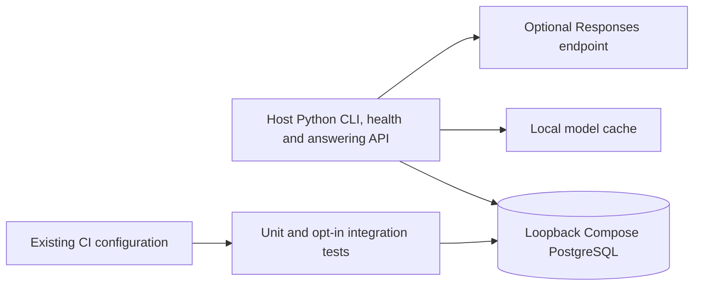
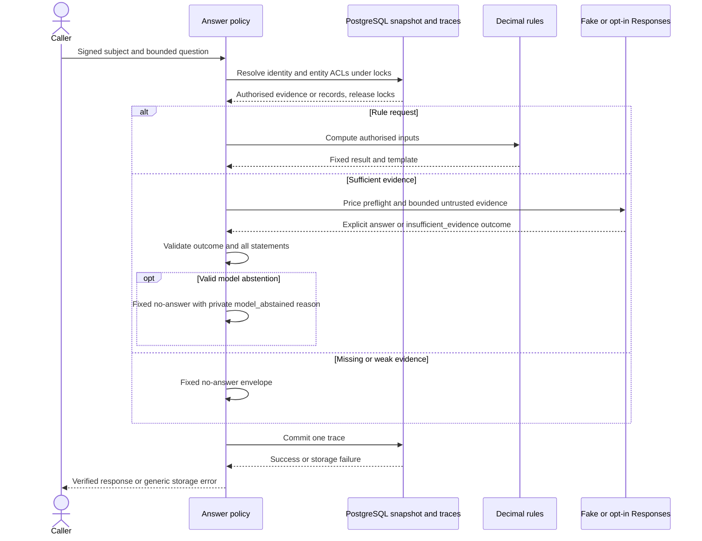
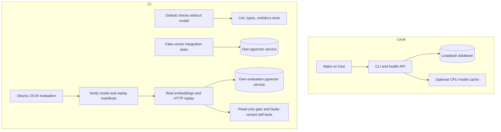

# Architecture: synthetic RAG audit demonstration

An assistant over internal documents must not expose restricted records or invent an answer that its sources cannot support. This synthetic demonstration puts access decisions, calculations and answer checks in application code, rather than trusting the language model to enforce them. It records each decision and replays fixed questions before changes are accepted, giving reviewers evidence to inspect rather than a promise of safety.

## Who does what

Caption: **Request ownership** — answering a question and reviewing a change are separate activities.
Legend: solid arrows show Implemented request flow; the lower panel describes Implemented CI checks and the human review process, not an automatic review of every answer. [Editable SVG](images/ownership-flow.svg).

The model proposes source quotations or declines to answer; it neither grants access nor calculates payouts. Rule questions use code-owned calculations and fixed wording by default; optional rephrasing may only select an allowed template, with a fixed-template fallback on failure. The figure shows the default rule path. A failed trace write prevents a successful response. These boundaries are implemented in [answer orchestration](../src/rag_audit/answering.py), [access rules](../src/rag_audit/access.py) and [answer verification](../src/rag_audit/policy.py), with [answering tests](../tests/test_answering.py) and [database tests](../tests/integration/test_answer_database.py).

## What is implemented, and what remains limited

The [evaluation harness](evaluation.md), versioned [baselines](evaluation-results.md), recorded replay gate and `local-calibrated-v2` default (V1 cosine >=0.70 with explicit abstention) are Implemented. Fake stays untuned. Reranker not adopted. [ADR 0030](decisions/0030-abstention-recalibration.md) records the dev-only profile selection. The [audit's hosted evidence](audit/report.md#10-regression-plan-and-existing-hosted-evidence) records passing and deliberately failing runs at identified revisions; it does not certify every later change.

Dev calibration and an experimental pairwise CPU reranker are Implemented. The reranker sees only the existing top-20 authorised candidates; it does not expand retrieval or change rules/verification. The [trial](reranker-dev.md) did not meet adoption criteria ([ADR 0023](decisions/0023-cpu-reranker-trial.md)); it is not deployed by default.

Implemented: health, corpus v3, transactional ingestion, scoped retrieval/rules, extractive answering, signed fixture identity, durable tracing and calibrated evaluation. Labels remain outside ingestion/generation boundaries. Generation defaults to fake; Responses is opt-in local only, never exercised live by CI. The [release gate lifecycle](release-gate.md) checks recorded behaviour, not future model responses. All domain records are synthetic.

Implemented data flow: `datasets/corpus-v3` → source/hash/structured-binding validation → unchanged chunker and ingestion. `datasets/evaluation` → offline label checks and independent SQL visibility comparison, never provider prompts. See [evaluation data](evaluation-data.md) and [ADR 0021](decisions/0021-versioned-evaluation-data.md). No database tables changed. Rule version v2 qualifies payout by status without changing arithmetic. Extractive verification rejection now presents as no-answer while its trace remains distinct; invalid rule rephrasing retains template fallback ([ADR 0022](decisions/0022-answer-outcome-presentation.md)).

## Key design ideas

1. Implemented: materialise eligible rows in SQL before exact vector and keyword ranking, never retrieve globally then discard forbidden hits.
2. Implemented: deterministic source slices with section paths and Unicode offsets; section paths enter embedding/full-text inputs without changing stored text.
3. Implemented: explicit CPU-only optional runtime, immutable model revision and no paid API in tests.
4. Implemented: code-owned rules, authorised extractive citations and a dev-calibrated real evidence gate; fake remains untuned.
5. Implemented: small synthetic real-model evaluation and recorded-behaviour regression gate. Results are not broad retrieval-quality proof.

## System context

The caller uses a local fixture identity, not a production sign-in service. The command-line and HTTP interfaces share the answering policy; PostgreSQL stores the documents, access metadata and traces.

Caption: **System context** — offline default and opt-in local real provider.
Legend: solid links are Implemented; dashed links are Planned.

## Containers

These are the processes needed to run the demonstration. The language model is optional; default fake answering works without a provider key.

Caption: **Containers** — logical processes, not an application Docker image.
Legend: all nodes and links are Implemented; real generation is opt-in and not in CI.

## Components

Read this detailed pipeline after the ownership overview. Evaluation labels describe expected outcomes for the tests; they are kept out of generation prompts.

Caption: **Components** — implemented retrieval pipeline.
Legend: all shown components and links are Implemented.

```mermaid
flowchart LR
    corpus["Tracked corpus v3"] --> files["Validated Markdown and ACL manifest"]
    labels["Drafted golden data and access intent"] --> checks["Offline facts and freeze checks"]
    files --> chunks["Section-aware exact source slices"]
    chunks --> embedding["Section path plus text embedding"]
    embedding --> ingest["Atomic single-corpus replacement"]
    ingest --> database[("Documents and chunks")]
    subject["Trusted fixture subject"] --> eligible["SQL eligible relation"]
    database --> eligible
    eligible --> ranking["Exact cosine plus full-text ranks"]
    ranking --> result["RRF and eligible-only raw signals"]
    eligible --> rules["Authorised structured Decimal rules"]
    result --> gate["Calibrated real cosine 0.70; fake demo gate; byte budgets"]
    labels --> evaluator["Isolated evaluator; dev calibration; logged test runs"]
    evaluator --> subject
    trace --> metrics["Independent facts, rules and counterfactual metrics"]
    gate --> fake["Offline fake evidence selector"]
    fake --> verify["Exact citation and echo verification"]
    gate --> real["Opt-in Responses: price and byte-bound preflight"]
    real --> verify
    rules --> template["Code-owned wording"]
    verify --> trace["Commit trace before release"]
    template --> trace
```

The [chunker](../src/rag_audit/chunking.py) targets 384 tokens, ceiling 480, overlap 48 only inside long sections, reserving space for section path and special tokens. The [adapter](../src/rag_audit/embeddings.py) uses the pinned ONNX export, CLS pooling and normalisation. The [retrieval statement](../src/rag_audit/retrieval.py) applies tier OR team OR owner/assigned-broker grants before both ranks. Claims must be restricted; customer/broker identities cannot join staff teams. [Decision 0014](decisions/0014-query-access-control.md) defines the trust boundary.

## Implemented answering flow

Caption: **Question-answering sequence** — offline answer decisions and durable traces.
Legend: messages are Implemented; real provider is opt-in local only; separate CI checks are described in the [release gate lifecycle](release-gate.md).

Nearest neighbours can be irrelevant. Raw retrieval is unchanged; answering applies the calibrated real or untuned fake gate and extractive policy. Hidden/absent explicit entities return identical no-answer; arbitrary free text has inaccessible-row noninterference, not hidden-intent detection. Constant-time execution is not promised.

## Implemented data model

Caption: **Data model** — actual shared-init schema.
Legend: entities and relationships are Implemented; teams are validated arrays, not a separate table.

```mermaid
erDiagram
    DEMO_USERS ||--o{ DEMO_DOCUMENTS : owns_claim
    DEMO_USERS ||--o{ DEMO_BROKERS : assigns
    DEMO_DOCUMENTS ||--o{ DEMO_CHUNKS : contains
    DEMO_DOCUMENTS ||--o| DEMO_POLICIES : authorises
    DEMO_DOCUMENTS ||--o| DEMO_CLAIMS : authorises
    DEMO_POLICIES ||--o{ DEMO_CLAIMS : applies
    DEMO_POLICIES {
        string id PK
        string document_id FK
        jsonb record
    }
    DEMO_CLAIMS {
        string id PK
        string document_id FK
        string policy_id FK
        jsonb record
    }
    DEMO_TRACES {
        string request_id PK
        timestamp created_at
        jsonb payload
    }
    DEMO_USERS {
        string subject PK
        string role
        string_array teams
    }
    DEMO_BROKERS {
        string broker FK
        string customer FK
    }
    DEMO_DOCUMENTS {
        string id PK
        string source
        string kind
        string tier
        string team
        string owner FK
    }
    DEMO_CHUNKS {
        string id PK
        string document_id FK
        string text
        string section
        int ordinal
        int start_offset
        int end_offset
        string tier
        string team
        string owner FK
        vector embedding
        tsvector search
        string corpus_version
        string model_identity
    }
    DEMO_CONFIGURATION {
        boolean singleton PK
        string model_identity
        string corpus_version
    }
```

[Ingestion](../src/rag_audit/ingestion.py) validates the complete manifest and computes vectors before atomically replacing the single managed corpus. Shared/exclusive advisory locks prevent mixed identity/corpus snapshots. Changed input removes stale rows; repeated input preserves IDs/counts. This is not a multi-corpus migration system. Run the same [initial SQL](../docker/init/001-enable-vector.sql) through Compose or `make db-init`.

## Deployment

Caption: **Deployment** — local and CI configuration.
Legend: nodes and links are Implemented configuration; the [audit evidence](audit/verification-evidence.json) identifies the revisions with recorded hosted verification, not a guarantee about subsequent runs.

## Quality, evidence and limits

- [Unit tests](../tests/test_retrieval_core.py) check deterministic generation/chunks, metadata restrictions and source offsets.
- [Integration tests](../tests/integration/test_retrieval.py) check role sets, forbidden-content noninterference, raw signals, idempotence and ANN underfill versus exact search.
- [Explicit real-model smoke](../tests/test_embedding_adapter.py) checks shape, normalisation, query instruction and Unicode offsets. The separate evaluation job exercises real embeddings and [replay self-tests](../tests/integration/test_gate_selftest.py); historical hosted results are retained in the [audit evidence](audit/verification-evidence.json).
- Exact search is linear in eligible rows; candidate bounds limit ranking output, not database work. No production identity provider or constant-time defence exists. Calibrated local and provisional CI gates do not establish production utility.
- [Answering tests](../tests/test_answering.py) and [database tests](../tests/integration/test_answer_database.py) cover trace failure, rules, role differentiation, absence equality and snapshot provenance. Table locks end before generation; trace commit is independent and requires an idle connection. Traces survive ingestion and contain no rejected provider payloads.
- Operator/database access is trusted. Corpus/model cache are ignored local state; CI checks model bytes against a publisher-derived committed manifest. HTTPS/publisher and repository review remain trust roots; metadata is not signed.
- Keep [technology choices](technology-choices.md), [patterns](patterns.md), [threat model](threat-model.md), [decisions](decisions/README.md) and [backlog](BACKLOG.md) aligned with actual evidence.
