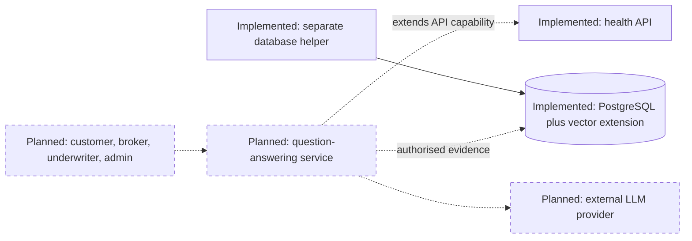
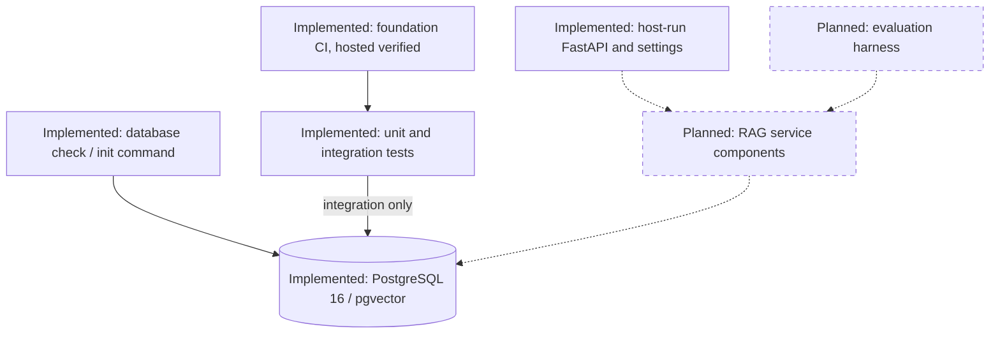
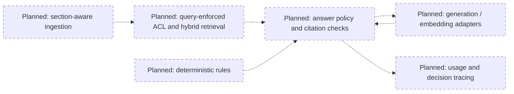
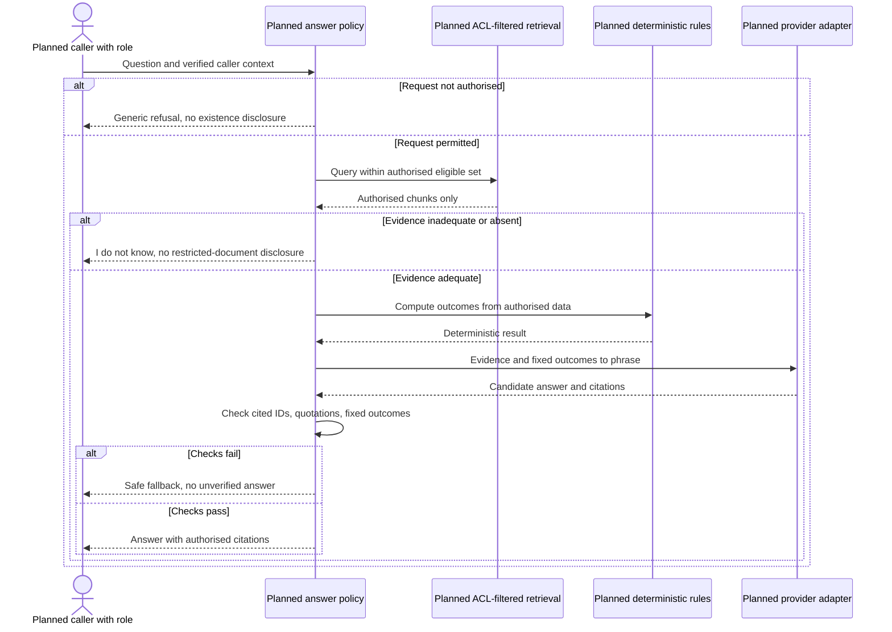
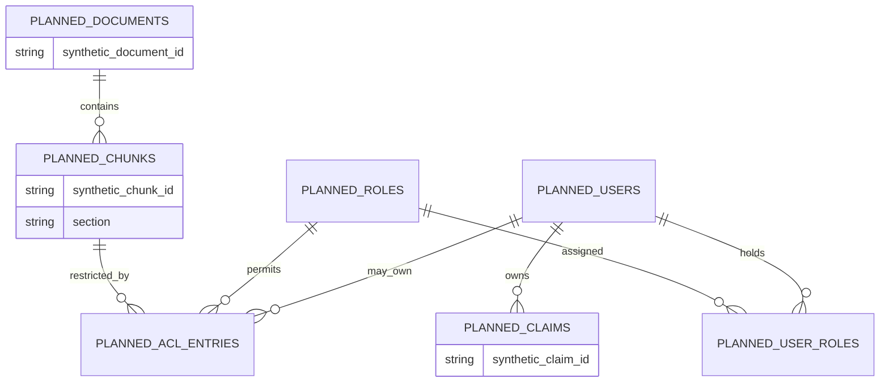
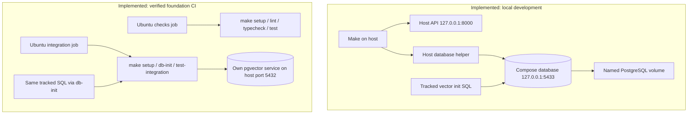

# Architecture: synthetic RAG audit demonstration

All domain data is synthetic; no corpus exists yet. The foundation is a health API and database/tooling skeleton, not an operational question-answering service. See the [evidence convention](README.md#evidence-convention) and [decision index](decisions/README.md).

## Key design ideas

1. **Planned — access control before retrieval.** Restrict eligible records inside the retrieval query before selecting ranked results, never fetch globally and discard forbidden answers afterwards. This aims to prevent cross-customer access and evidence contamination; query plans and recall remain unvalidated.
2. **Planned — deterministic core with an LLM shell.** Code computes business outcomes; the model may phrase them but must not choose them. This prevents invented eligibility or monetary outcomes from becoming authoritative.
3. **Planned — evidence-carrying answers with explicit “I don't know”.** Answers must cite the caller's authorised retrieved evidence and pass quotation checks, or decline when evidence is inadequate. This targets fabricated support without pretending citation correctness alone proves faithfulness.
4. **Planned — evaluation as a release gate.** A labelled regression set will test leaks, citations, rules, quality, latency, and cost before release. It prevents known regressions being accepted on the strength of a few demonstrations; current CI checks only the foundation.
5. **Implemented, limited scope — fail-closed defaults.** Database operations fail without configuration and rendered errors mask connection secrets, while `/health` remains database-independent. This prevents implicit database selection and tested disclosure paths, not arbitrary logging or authentication failures; see the [threat model](threat-model.md).

## Implemented foundation and planned scope

**Implemented:** [`/health`](../src/rag_audit/api/main.py), [settings](../src/rag_audit/settings.py), [database checks/init](../src/rag_audit/db.py), [Compose](../compose.yaml), [shared SQL](../docker/init/001-enable-vector.sql), [Make commands](../Makefile), and [CI](../.github/workflows/ci.yml). Health reports installed package metadata without a database call, as covered by [unit tests](../tests/test_health.py); vector availability has a separate [integration test](../tests/integration/test_database.py). Hosted foundation CI is verified for the revision in the reading guide, not every future revision.

**Planned:** synthetic customer, broker, underwriter and administrator roles; documents/claims; hybrid search; deterministic rules; generated answers; tracing; evaluation; and an audit report. Roles express intent, not a current identity system. Concrete schemas, algorithms and thresholds remain [pending](decisions/README.md#pending-decisions).

## System context

Caption: **System context** — foundation within the planned synthetic-domain service.
Legend: solid outlines/arrows = implemented; dashed outlines/arrows and Planned labels = future capability; human roles are prospective.

## Containers

Caption: **Containers** — logical processes and stores, not an API Docker image.
Legend: solid = implemented; dashed = planned; CI verification is revision-scoped.

The database represents a technology, not a shared local/CI instance. The deployment diagram distinguishes those instances.

## Planned components

Caption: **Components** — conceptual boundaries, none implemented yet.
Legend: all nodes and dashed arrows are Planned; this does not prescribe final module names.

Query-level ACL constraints are not proof of physical filter-before-ANN execution. [pgvector documents post-scan filtering for approximate indexes](https://github.com/pgvector/pgvector#filtering); [ADR 0004](decisions/0004-postgresql-pgvector.md) defers retrieval design/validation rather than weakening the invariant.

## Planned answering flow

Caption: **Question-answering sequence** — target behaviour; identity and ACL representation remain undecided.
Legend: all participants/messages/branches are Planned; sequence arrows show message direction, not implementation status.

Inaccessible and absent evidence must not receive distinguishing disclosures. Refusal policy, output checks and fallback wording need adversarial tests before any implemented claim.

## Planned data model

Caption: **Data model** — conceptual relationships, not a migration or final ACL schema.
Legend: every entity/attribute/relationship is Planned; candidate cardinalities require validation during modelling.

These are synthetic identifier labels. Ownership, broker-client scope, role combinations and document-versus-chunk ACL attachment are unresolved; no allow/deny precedence is decided here.

## Implemented deployment

Caption: **Deployment** — current local/CI layouts; foundation hosted CI verified in a private repository run.
Legend: all nodes/arrows are Implemented configuration or observed foundation execution; no production deployment is implied.

Local shutdown retains data. CI uses its own service container, not Compose or the local volume: [workflow](../.github/workflows/ci.yml), [Compose](../compose.yaml), [GitHub services](https://docs.github.com/en/actions/tutorials/use-containerized-services/create-postgresql-service-containers). Runner/cache follow-ups remain in the [backlog](BACKLOG.md).

## Quality attributes, constraints, and non-goals

| Status | Attribute / constraint | Mechanism and limit |
| --- | --- | --- |
| Implemented | Repeatable Python setup | [Lockfile](../uv.lock), frozen [commands](../Makefile); not bit-reproducible OS/browser builds. |
| Implemented | Docker-free feedback | [Unit isolation](../tests/conftest.py); integration opt-in, not guaranteed service availability. |
| Implemented | Tested secret masking | [Settings](../tests/test_settings.py), [errors](../tests/test_db.py); no guarantee for deliberately unwrapped values or arbitrary new logs. |
| Implemented | Configuration/doc regression checks | [Configuration tests](../tests/test_configuration.py), [docs tests](../tests/test_docs.py); known bypasses disclosed. |
| Planned | Authorised grounded answers | Query design, citations, rules, future adversarial tests; no current certification. |
| Planned | Quality/cost release control | Golden cases, calibrated judging, thresholds, usage accounting; none measured yet. |
| Rejected for current scope | Production claims | No production identity provider, tenancy guarantee, availability target or throughput benchmark. |
| Rejected for current scope | Broader product features | No multi-agent orchestration, fine-tuning, voice, non-English support or polished UI. |

Continue with [patterns](patterns.md) and the [threat model](threat-model.md) for precise test/limitation mappings.
