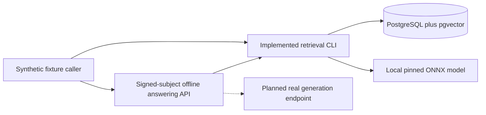
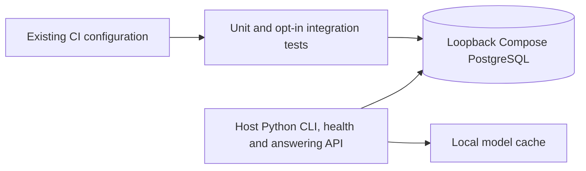
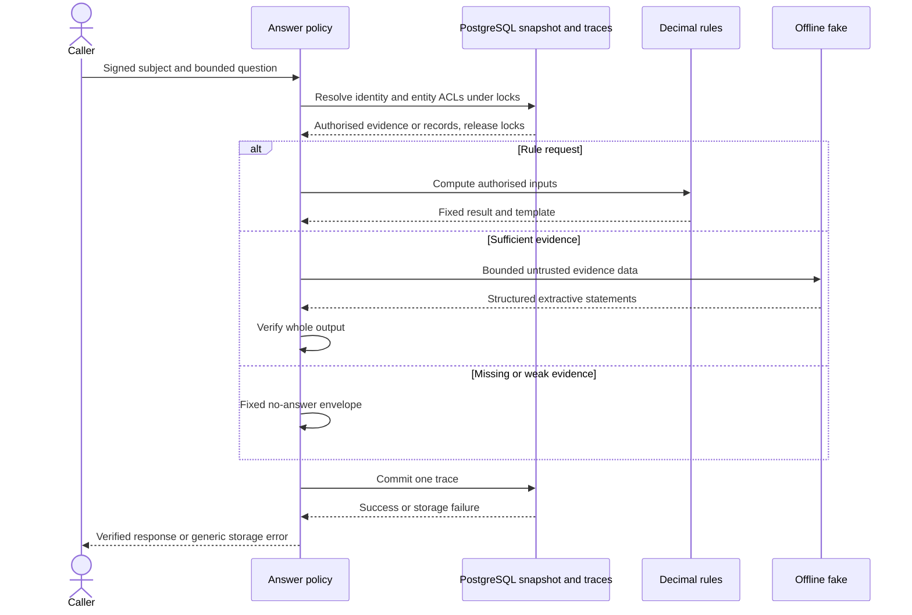
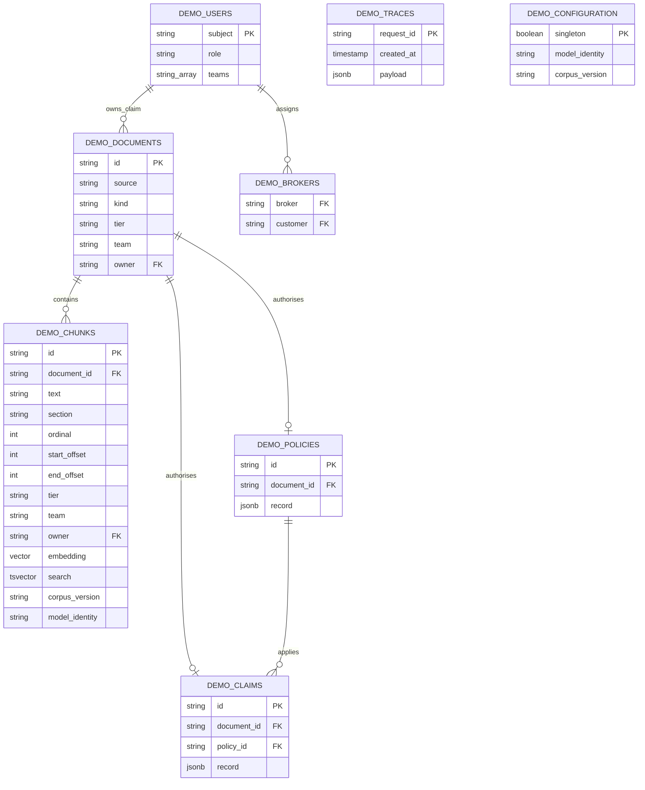
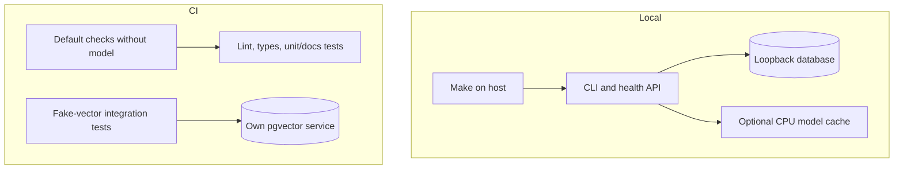

# Architecture: synthetic RAG audit demonstration

Implemented: health, corpus v2, transactional ingestion, scoped hybrid retrieval and rules, extractive fake answering, signed fixture identity and durable tracing. Planned: real generation, calibrated evaluation and release gating. All domain records are fictional and labelled synthetic.

## Key design ideas

1. Implemented: materialise eligible rows in SQL before exact vector and keyword ranking, never retrieve globally then discard forbidden hits.
2. Implemented: deterministic source slices with section paths and Unicode offsets; section paths enter embedding/full-text inputs without changing stored text.
3. Implemented: explicit CPU-only optional runtime, immutable model revision and no paid API in tests.
4. Implemented: deterministic rules with code-owned wording, authorised extractive citations and provisional evidence-sensitive abstention.
5. Planned: real-model quality evaluation and a regression gate. Current local tests are security/mechanics checks, not broad retrieval-quality proof.

## System context

Caption: **System context** — current offline answering and planned real provider.
Legend: solid links are Implemented; dashed links are Planned.

## Containers

Caption: **Containers** — logical processes, not an application Docker image.
Legend: all nodes and links are Implemented; external generation is absent.

## Components

Caption: **Components** — implemented retrieval pipeline.
Legend: all shown components and links are Implemented.

```mermaid
flowchart LR
    corpus["Seeded corpus generator"] --> files["Markdown and ACL manifest"]
    files --> chunks["Section-aware exact source slices"]
    chunks --> embedding["Section path plus text embedding"]
    embedding --> ingest["Atomic single-corpus replacement"]
    ingest --> database[("Documents and chunks")]
    subject["Trusted fixture subject"] --> eligible["SQL eligible relation"]
    database --> eligible
    eligible --> ranking["Exact cosine plus full-text ranks"]
    ranking --> result["RRF and eligible-only raw signals"]
    eligible --> rules["Authorised structured Decimal rules"]
    result --> gate["Versioned gate and byte budgets"]
    gate --> fake["Offline fake evidence selector"]
    fake --> verify["Exact citation and echo verification"]
    rules --> template["Code-owned wording"]
    verify --> trace["Commit trace before release"]
    template --> trace
```

The [chunker](../src/rag_audit/chunking.py) targets 384 tokens, ceiling 480, overlap 48 only inside long sections, reserving space for section path and special tokens. The [adapter](../src/rag_audit/embeddings.py) uses the pinned ONNX export, CLS pooling and normalisation. The [retrieval statement](../src/rag_audit/retrieval.py) applies tier OR team OR owner/assigned-broker grants before both ranks. Claims must be restricted; customer/broker identities cannot join staff teams. [Decision 0014](decisions/0014-query-access-control.md) defines the trust boundary.

## Implemented answering flow

Caption: **Question-answering sequence** — offline answer decisions and durable traces.
Legend: all messages are Implemented; real provider and evaluation remain Planned.

Nearest neighbours can be irrelevant. Raw retrieval is unchanged; answering applies the provisional gate and extractive policy. Hidden/absent explicit entities return identical no-answer; arbitrary free text has inaccessible-row noninterference, not hidden-intent detection. Constant-time execution is not promised.

## Implemented data model

Caption: **Data model** — actual shared-init schema.
Legend: entities and relationships are Implemented; teams are validated arrays, not a separate table.

[Ingestion](../src/rag_audit/ingestion.py) validates the complete manifest and computes vectors before atomically replacing the single managed corpus. Shared/exclusive advisory locks prevent mixed identity/corpus snapshots. Changed input removes stale rows; repeated input preserves IDs/counts. This is not a multi-corpus migration system. Run the same [initial SQL](../docker/init/001-enable-vector.sql) through Compose or `make db-init`.

## Deployment

Caption: **Deployment** — local and CI configuration.
Legend: nodes and links are Implemented configuration; hosted execution is verified only for the historical foundation, not this increment.

## Quality, evidence and limits

- [Unit tests](../tests/test_retrieval_core.py) check deterministic generation/chunks, metadata restrictions and source offsets.
- [Integration tests](../tests/integration/test_retrieval.py) check role sets, forbidden-content noninterference, raw signals, idempotence and ANN underfill versus exact search.
- [Explicit real-model smoke](../tests/test_embedding_adapter.py) checks shape, normalisation, query instruction and Unicode offsets. Default CI does not execute it; a cache-backed real-model evaluation remains required.
- Exact search is linear in eligible rows; candidate bounds limit ranking output, not database work. No production identity provider, constant-time defence, calibrated abstention or quality gate exists.
- [Answering tests](../tests/test_answering.py) and [database tests](../tests/integration/test_answer_database.py) cover trace failure, rules, role differentiation, absence equality and snapshot provenance. Table locks end before generation; trace commit is independent and requires an idle connection. Traces survive ingestion and contain no rejected provider payloads.
- Operator/database access is trusted. Corpus and model cache are ignored local state; initial model download trusts HTTPS/publisher, and local hash metadata is not signed.
- Keep [technology choices](technology-choices.md), [patterns](patterns.md), [threat model](threat-model.md), [decisions](decisions/README.md) and [backlog](BACKLOG.md) aligned with actual evidence.
