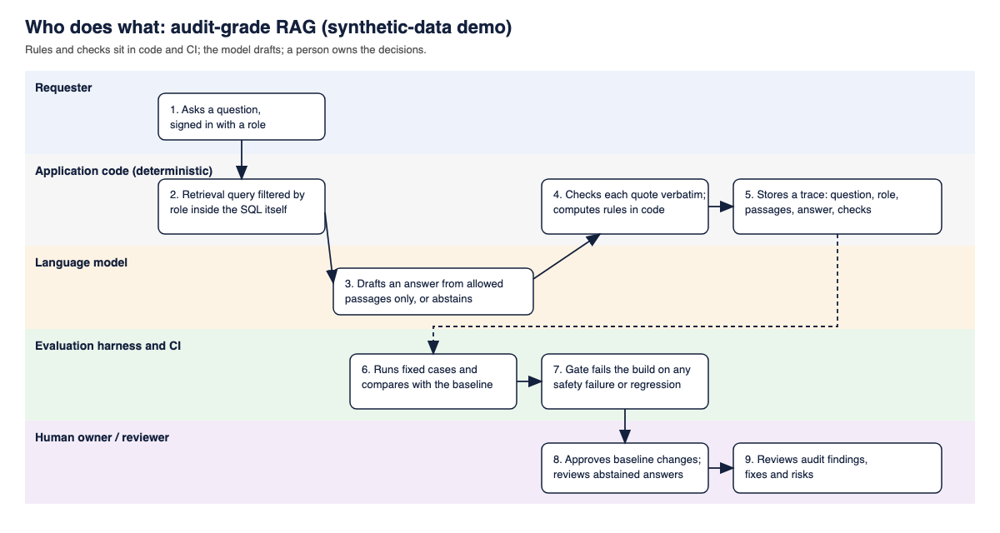

# rag-audit-demo

**In plain English.** Companies are putting AI assistants on top of their own documents. Two questions decide whether that is safe: does the assistant ever show someone a document they must not see, and can you prove each answer came from a real source and notice when quality drops after a change? This small, fully synthetic project answers both with tests, and an audit report records what worked and what did not.

**What it does.** You ask a question as a particular person, such as a customer or a broker. The service searches only the documents that person may see, drafts an answer, quotes the exact words it relied on and refuses when it finds no evidence. Money amounts come from ordinary code, not the AI. Every request is logged. Tests replay fixed questions on every change and block the change if safety fails or quality drops.

**Who it is for.** Teams building or buying an assistant over internal documents, and reviewers who want to see what auditing one looks like.



It is a builder self-assessment, not an independent audit or production service. Built with AI coding assistants under Venkata K Gonela's direction.

**[Read the sample audit report](../../docs/audit/report.pdf)** · [Markdown report](../../docs/audit/report.md) · [Evaluation method](../../docs/evaluation.md) · [Architecture](../../docs/ARCHITECTURE.md)

## Three tested promises

- **Access inside the query:** authorised documents are selected before ranking. Proof: `uv run pytest tests/integration/test_retrieval.py --run-integration` (disposable database).
- **Verifiable quotes:** every accepted statement cites authorised evidence and exact source text. Proof: `uv run pytest tests/test_answer_policy.py`.
- **A gate that can fail:** recorded requests, safety constraints and quality checks stop regressions. Proof: `make eval-selftest`; [deliberate gate regression #7](https://github.com/venkatakgonela/rag-audit-demo/pull/7) and [access regression #8](https://github.com/venkatakgonela/rag-audit-demo/pull/8).

## Results at a glance

{{comparison}}

These are correct answerable single/multi phrasings, not system-wide accuracy; two other test phrasings regressed. Small authored samples and repeated test exposure limit inference. **{{review}}** An AI reviewer checked all 65 labels against their sources and found no factual, outcome or visibility disagreement and three wording notes ([record](../../docs/audit/label-review.md)); that is not human review and not independent of the AI-assisted build, and every label remains `drafted`.

## Try it locally

Needs Git, Make, uv/Python 3.12 and Docker Compose; tested on macOS only. Fake answering needs no model or provider key.

```sh
git clone https://github.com/venkatakgonela/rag-audit-demo.git
cd rag-audit-demo
make setup
make up
make generate-corpus
make ingest ARGS="--fake"
make ask ARGS='--fake --subject synthetic-customer-a --query "Synthetic Hearth edition 1 drying diary reading"'
```

The answer includes: “The drying diary must show a reading every 24 hours.” For the same customer, contrast a restricted-topic request with a code-calculated payout:

```sh
make ask ARGS='--fake --subject synthetic-customer-a --query "broker reconciliation"'
make ask ARGS='--fake --subject synthetic-customer-a --query "payout synthetic-claim-0"'
```

The first returns “I cannot answer from the available evidence.” The second returns “Payout in GBP: 400.00 (calculation only; claim status: pending).” Synthetic outputs, not insurance advice.

If port 5433 is busy, change `POSTGRES_PORT` and `DATABASE_URL` in `.env`. `make down` stops the database without deleting its volume. Checks without Docker: `make lint typecheck test`. See [developer setup](../../docs/development.md).

## Limits

All insurance-like data and identities are fabricated. CI tests recorded behaviour, not future model behaviour. Exact quotation is not semantic completeness. The identity stub, timing and resource bounds, retained questions and mutable supply-chain references are not production controls. Prompt-injection checks cover a small fixture set; no resistance, compliance or availability guarantee is made. Read the findings and the two lost test successes, not only the improvements.

## Licence and author

MIT © 2026 Venkata K Gonela. See [LICENSE](../../LICENSE), [notices](../../docs/third-party-notices.md), [security](../../SECURITY.md), [contributing](../../CONTRIBUTING.md), [publication provenance](../../docs/PUBLISHING.md) and [docs index](../../docs/README.md). Dependencies retain their licences; model weights are not redistributed.
