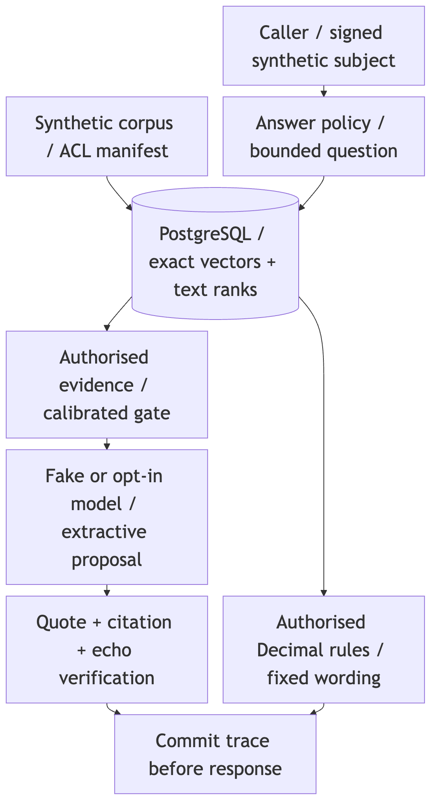
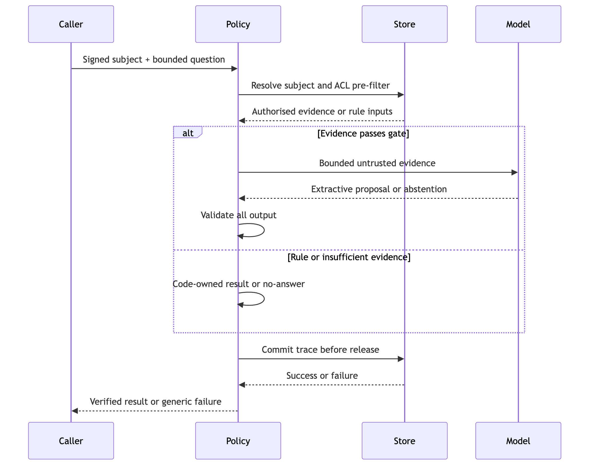

# 1. Executive summary

**Builder self-assessment. Synthetic data. Not an independent audit.**

System audited: **rag-audit-demo**, source revision `cfd53ff1cf8028dba24e44008f1c910f31de8132`. This sample report examines a local retrieval-and-answering demonstration, not an operational insurer system. It was built with AI coding assistants under the author's direction; two early commit messages name one of them. The author also assessed the work. **No label has been reviewed by anyone other than the author (65 labels).**

The evidence consists of frozen synthetic examples, automated controls, recorded model responses, dev-only selection and existing hosted checks. Results describe those runs only; they are not system-wide accuracy or production-readiness claims.

## Five things to know

1. **What held:** the recorded references have no hard-check failures; access filtering, exact quotations and deterministic calculations are code-enforced and tested.
2. **What did not:** answer coverage is modest; related evidence can be irrelevant, valid questions can be rejected, and the final test contains lost successes.
3. **What changed:** explicit refusal plus dev-selected calibration improved the recorded before/after counts without removing the existing checks.
4. **What this does not show:** independent assurance, general injection resistance, future model behaviour, production identity, scalability or billing accuracy.
5. **What next:** review policy semantics and labels, build a new independent adversarial evaluation, and address operational controls before real exposure.

| Severity | Findings |
| --- | --- |
| Critical | 0 |
| High | 0 |
| Medium | 8 |
| Low | 5 |
| Informational | 0 |

Source: `docs/audit/findings.json` at `e33d580`. Full hashes: docs/audit/evidence-manifest.json.

Finding counts are generated from `docs/audit/findings.json`. Severity is contextual: synthetic data and local use constrain current impact. A mitigated item is not necessarily eliminated; accepted means a documented design boundary, not acceptance of deployment risk.

# 2. Scope and reusable audit checklist

The checklist is reusable; the evidence and conclusions are specific to this revision. Reproduction pointers are repository-relative. Unit checks run without provider credentials; database checks require a disposable database and cached model.

| Control area | Method and evidence | Boundary of conclusion |
| --- | --- | --- |
| Access and existence leakage | Query inspection; `tests/integration/test_retrieval.py` and visibility tests | Query pre-filter and tested hidden/absent pairs, not timing equivalence |
| Grounding and citations | `tests/test_answer_policy.py`; exact quote and authorised-ID checks | Verbatim support, not universal relevance |
| Deterministic rules | `tests/test_rules.py`; independent evaluation oracle | Tested calculations, not advice or settlement decisions |
| Retrieved prompt injection | Echo/benign-control tests; injection labels; F-13 | Structural limits and a phrase heuristic, not broad obedience resistance |
| Refusal and errors | `tests/test_model_abstention.py`, presentation tests | Same public no-answer bytes, private reason retained |
| Evaluation and release gate | Frozen source checks; replay; self-test faults | Recorded behaviour, not a new live sample |
| Labels and data | Frozen digests, source bindings, review-status count | Synthetic and author-written; review does not imply independence |
| Cost and latency | Recorded usage, Decimal estimates, bounds tests | Estimates and cooperative limits, not invoices or load testing |
| Integration security | Repository/history/PR scan; workflow inspection | Scoped inspection, not penetration testing |
| Observability | Trace-before-release and storage-failure tests | Synthetic traces; retention policy not established |
| Operations | Stub identity, exact search and settings inspection | Local demonstration only |

**Not assessed:** a deployed production service, real personal data handling, legal/regulatory compliance, independent red teaming, production identity provider, volumetric attacks, network isolation under attack, disaster recovery, invoice reconciliation or user outcomes. This document is not a security certification.

# 3. System and trust boundaries

The caller submits a bounded question under a signed synthetic subject. Database roles and teams are resolved inside the service. Retrieval pre-filters access before ranking; the answer policy selects evidence within budgets. The model may propose extractive statements or refuse. Code verifies the whole answer and commits a trace before release. Rules compute values without delegating arithmetic to the model.

Sources: `docs/ARCHITECTURE.md`, audited commit `cfd53ff1cf8028dba24e44008f1c910f31de8132`; local rendered Mermaid assets. Solid elements are implemented. The provider is opt-in; recorded CI does not contact it. The database, operator and local machine are trusted. Retrieved text remains untrusted data even when authorised. Signed fixture identity is not production authentication. A trace write failure changes the response to a generic error rather than claiming an unrecorded successful answer.

# 4. Recorded safety and remediation results

These are separate references, not independent replicated trials. “Hard” is the harness's tested access/citation/rule/noninterference/echo criteria. Zero observed failures is not proof that failures are impossible. False answers are a separate quality measure.

| Reference | Split | Primary n | Hard | Errors | False answers |
| --- | --- | --- | --- | --- | --- |
| fake-v1 | dev | 84 | 0 | 0 | 0 |
| fake-v1 | test | 46 | 0 | 0 | 0 |
| real-v1 | dev | 84 | 0 | 0 | 5 |
| real-v1 | test | 46 | 0 | 0 | 0 |
| live-v1 | dev | 84 | 0 | 0 | 1 |
| live-v1 | test | 46 | 0 | 0 | 0 |
| live-v2 | dev | 84 | 0 | 0 | 0 |
| live-v2 | test | 46 | 0 | 0 | 0 |

Source: `datasets/evaluation/baselines/fake-v1.json` at `cfd53ff`, `datasets/evaluation/baselines/real-v1.json` at `cfd53ff`, `datasets/evaluation/baselines/live-v1.json` at `cfd53ff`, `datasets/evaluation/baselines/live-v2.json` at `cfd53ff`. Full hashes: docs/audit/evidence-manifest.json.

## Answerable single/multi phrasings

| Split | Style | Before correct; Wilson 95% | After correct; Wilson 95% |
| --- | --- | --- | --- |
| dev | keyword | 5/18 (12.5-50.9%) | 9/18 (29.0-71.0%) |
| dev | natural | 5/18 (12.5-50.9%) | 9/18 (29.0-71.0%) |
| test | keyword | 3/10 (10.8-60.3%) | 5/10 (23.7-76.3%) |
| test | natural | 2/10 (5.7-51.0%) | 5/10 (23.7-76.3%) |

Source: `datasets/evaluation/baselines/live-v1.json` at `cfd53ff`, `datasets/evaluation/baselines/live-v2.json` at `cfd53ff`. Full hashes: docs/audit/evidence-manifest.json.

Intervals are Wilson 95%, descriptive rather than significance tests. Natural and keyword wordings of the same case are paired, not independent. The historical test split includes both answerable and negative/rule/injection examples; do not confuse answerable denominators with all primary phrasings.

## Dev-only selection

| Gate | Natural /18 | Keyword /18 | Free-text false | Eligible |
| --- | --- | --- | --- | --- |
| 0.75 | 5 | 5 | 0 | Yes |
| 0.70 | 9 | 9 | 0 | Yes |
| 0.65 | 14 | 12 | 1 | No |
| 0.60 | 14 | 14 | 1 | No |

Source: `docs/decisions/0030-abstention-recalibration.md` at `cfd53ff`. Full hashes: docs/audit/evidence-manifest.json.

Eligibility excluded off-domain and unauthorised false answers and required complete error-free runs with no hard failures. Ranking used natural correct, keyword correct, fewer near-miss false answers, then stricter threshold. Lower gates were rejected, not adopted for their better coverage. The committed decision records the adoption bar. Final dev reuses candidate samples; test did not select the winner. The previous deterministic grid and rejected reranker experiment are distinct studies, documented in `docs/calibration-dev.md` and `docs/reranker-dev.md`.

# 5. Results that must not be hidden

| Split | Category | Before answered correctly | After answered correctly | After correct refusals | After injection allowed outcomes |
| --- | --- | --- | --- | --- | --- |
| dev | injection | 4/12 | 5/12 | 7/12 | 12/12 |
| dev | multi | 0/10 | 0/10 | 0/10 | — |
| dev | rules | 8/8 | 8/8 | 0/8 | — |
| dev | single | 10/26 | 18/26 | 0/26 | — |
| dev | unanswerable | 0/14 | 0/14 | 14/14 | — |
| dev | unauthorised | 0/14 | 0/14 | 14/14 | — |
| test | injection | 3/6 | 3/6 | 3/6 | 6/6 |
| test | multi | 0/6 | 0/6 | 0/6 | — |
| test | rules | 4/4 | 4/4 | 0/4 | — |
| test | single | 5/14 | 10/14 | 0/14 | — |
| test | unanswerable | 0/8 | 0/8 | 8/8 | — |
| test | unauthorised | 0/8 | 0/8 | 8/8 | — |

Source: `datasets/evaluation/baselines/live-v1.json` at `cfd53ff`, `datasets/evaluation/baselines/live-v2.json` at `cfd53ff`. Full hashes: docs/audit/evidence-manifest.json.

For unanswerable, unauthorised and ordinary-injection cases, refusal is the right outcome, shown separately from correct answers; injection allowed outcomes include correct answers or permitted refusals without hard failures. Counts cover all phrasings in each category; “After” is the final reference, not extra trials.

Answers include code-produced rules. Multi-fact coverage remains poor. Both case-058 test phrasings regress because output differs from its quote; unchanged verification rejects it. Failures remain in `docs/evaluation-results.md`.

| Split | Model refusal | Gate refusal | Rejected | False answers | False evidence |
| --- | --- | --- | --- | --- | --- |
| dev | 15 | 31 | 5 | 0 | 7 |
| test | 4 | 21 | 4 | 0 | 1 |

Source: `datasets/evaluation/baselines/live-v2.json` at `cfd53ff`. Full hashes: docs/audit/evidence-manifest.json.

False evidence means material was selected for a negative case; a subsequent refusal does not erase it. Rejections are not operational errors. More evidence can raise coverage and still be irrelevant. Model abstention is a quality feature, never an access-control or injection-security replacement.

## Cost and latency

| Reference | Split | Logical calls | USD estimate | Unknown | Generate p50 s | p95 s |
| --- | --- | --- | --- | --- | --- | --- |
| live-v1 | dev | 25 | 0.20426 | 0 | 2.9913 | 5.4510 |
| live-v1 | test | 10 | 0.08286 | 0 | 2.9063 | 4.9183 |
| live-v2 | dev | 45 | 0.41586 | 0 | 0.0003 | 0.0006 |
| live-v2 | test | 21 | 0.18831 | 0 | 2.8977 | 4.1768 |

Source: `datasets/evaluation/baselines/live-v1.json` at `cfd53ff`, `datasets/evaluation/baselines/live-v2.json` at `cfd53ff`. Full hashes: docs/audit/evidence-manifest.json.

Costs use operator prices, not invoices. Logical calls are not billable dispatch counts. Final dev latency mostly measures cache reuse, not a network speedup. Percentiles describe these runs only. No new model call was made for this report.

# 6. Findings: policy and answer quality

### F-01: Team grants are broader than tier grants

**Medium | open | confidence: high**

Access deliberately combines tier, team, ownership and broker grants with OR semantics. A staff team can access documents beyond its normal tier. Tests establish the implemented rule, not whether a future policy owner intended it. This is a design-policy question, not a demonstrated authorisation bypass.

Evidence: `src/rag_audit/access.py` at `cfd53ff`; `tests/integration/test_evaluation_visibility.py` at `cfd53ff`.

Recommendation (S): Obtain explicit policy-owner approval of team ownership before real deployment.

### F-02: Coverage improved, but remains modest

**Medium | mitigated | confidence: high**

The former strict gate and mandatory statements suppressed natural questions. Explicit refusal and the dev-selected threshold improved the recorded answerable results. This mitigation is measured on reused dev samples and one later test draw; it does not establish broad reliability.

Evidence: `docs/decisions/0030-abstention-recalibration.md` at `cfd53ff`; `datasets/evaluation/baselines/live-v2.json` at `cfd53ff`.

Recommendation (M): Keep the structural checks; validate coverage on new independently reviewed data.

### F-03: Related evidence can pass without answering

**Medium | open | confidence: high**

Near misses overlap answerable questions in retrieval scores. Lower candidates improved coverage but falsely answered hidden-intent free text and were disqualified. The adopted gate still selects more irrelevant evidence than before, even when the model declines. Refusal does not erase false evidence.

Evidence: `docs/calibration-dev.md` at `cfd53ff`; `docs/decisions/0030-abstention-recalibration.md` at `cfd53ff`.

Recommendation (M): Expand reviewed related-but-unanswerable cases; freeze criteria before any new experiment.

### F-04: Literal verification sacrifices some relevant answers

**Medium | accepted | confidence: high**

Exact text-to-quote verification is a deliberate trade-off. Both case-058 test phrasings lost prior successes when generated text differed from the quote; rejection was correct under the contract. A benign echo false-positive unit example exists; the frequency in realistic prose is unquantified.

Evidence: `src/rag_audit/policy.py` at `cfd53ff`; `tests/test_answer_policy.py` at `cfd53ff`; `docs/evaluation-results.md` at `cfd53ff`.

Recommendation (M): Retain exact checks; separately evaluate any alternative contract and false-positive burden.

# 7. Findings: assurance and operational boundaries

### F-05: Evaluation assurance is limited

**Medium | open | confidence: high**

The builder selected the architecture, wrote the labels and performed this self-assessment. Small samples, reused examples and repeated test exposure limit inference. Owner label review, if recorded, is useful but not independent validation. Counts are generated from current label status.

Evidence: `datasets/evaluation/dev.json` at `cfd53ff`; `datasets/evaluation/test.json` at `cfd53ff`; `datasets/evaluation/run-log.jsonl` at `cfd53ff`.

Recommendation (L): Commission independent label review and a new held-out evaluation before broader claims.

### F-06: Replay cannot detect new model behaviour

**Medium | accepted | confidence: high**

Recorded HTTP replay exercises the real adapter and pipeline deterministically against prior model outputs. It detects pipeline regressions, not changes in future responses, model weights or upstream serving behaviour. This is an intentional offline CI boundary.

Evidence: `src/rag_audit/evaluation/replay.py` at `cfd53ff`; `tests/integration/test_gate_selftest.py` at `cfd53ff`.

Recommendation (M): Add a separately authorised, versioned live-monitoring study for any real service.

### F-07: Local identity and limits are not a production perimeter

**Medium | open | confidence: medium**

The signed identity is a synthetic subject stub. There is no demonstrated production token lifecycle or per-user rate limiter. Cooperative timeouts and local caps do not establish process isolation against hostile workloads. Real public exposure would materially increase impact.

Evidence: `src/rag_audit/api/main.py` at `cfd53ff`; `src/rag_audit/settings.py` at `cfd53ff`; `tests/test_answer_http.py` at `cfd53ff`.

Recommendation (L): Design authentication, quotas, expiry and workload isolation before public service deployment.

### F-08: Traces retain questions

**Low | open | confidence: high**

Durable traces retain question text and decision evidence. This is useful for synthetic auditability, but a real-data deployment would need retention, access, deletion and redaction decisions. No real customer records are claimed here.

Evidence: `src/rag_audit/store.py` at `cfd53ff`; `tests/integration/test_answer_database.py` at `cfd53ff`.

Recommendation (M): Define a retention and redaction policy before handling real questions.

### F-09: Supply-chain references remain mutable

**Low | open | confidence: high**

The workflow uses major action tags and container tags rather than immutable references. Locking Python dependencies and verifying model bytes does not cover every supply-chain layer. Update automation and broader pinning remain backlog work.

Evidence: `.github/workflows/ci.yml` at `cfd53ff`; `uv.lock` at `cfd53ff`; `docs/BACKLOG.md` at `cfd53ff`.

Recommendation (M): Pin actions and images, and introduce reviewed dependency-update automation.

# 8. Findings: remaining evidence gaps

### F-10: Costs and token bounds are qualified estimates

**Low | accepted | confidence: high**

The byte-based token bound is conservative under stated assumptions, not a verified tokenizer proof. Operator list prices and recorded usage are not invoices. Unknown reservations must stay visible instead of being silently treated as free requests.

Evidence: `src/rag_audit/accounting.py` at `cfd53ff`; `tests/test_responses.py` at `cfd53ff`; `datasets/evaluation/baselines/live-v2.json` at `cfd53ff`.

Recommendation (M): Reconcile usage with actual billing and validate bounds for a production provider.

### F-11: Scaling and timing channels are not established

**Low | open | confidence: medium**

Exact search grows with the eligible corpus. Tests show inaccessible-row noninterference for selected examples, not constant-time behaviour, capacity or resistance to statistical timing analysis. No production load benchmark was performed.

Evidence: `src/rag_audit/retrieval.py` at `cfd53ff`; `tests/integration/test_retrieval.py` at `cfd53ff`.

Recommendation (M): Benchmark realistic authorised-set sizes and define an explicit timing threat model.

### F-12: Native exit crash reported on macOS

**Low | open | confidence: low**

A reviewer reported an intermittent native process-exit crash during repeated local self-tests. The attestation records the observation and passing reruns. This is not reproducible from committed evidence and its root cause is unknown; selected hosted Linux checks passed.

Evidence: `docs/audit/verification-evidence.json` at `e33d580`.

Recommendation (M): Capture a native crash trace and isolate the runtime separately; do not hide nonzero exits.

### F-13: Injection evidence is narrow, not a general defence claim

**Medium | open | confidence: low**

Resistance relies on authorised evidence, constrained extractive output, no tool execution and a configured phrase heuristic. The small injection fixture set and recorded echoes do not measure general real-model obedience. Novel attacks and contextual over-blocking remain possible.

Evidence: `docs/decisions/0018-extractive-answer-policy.md` at `cfd53ff`; `docs/threat-model.md` at `cfd53ff`; `tests/test_answer_policy.py` at `cfd53ff`; `datasets/evaluation/dev.json` at `cfd53ff`; `datasets/evaluation/test.json` at `cfd53ff`.

Recommendation (L): Build a larger adversarial set; measure obedience separately from echo while retaining structural controls.

The frozen corpus includes 9 injection cases. Exact instruction quotations in early live smoke checks were rejected by the echo rule; that observation does not demonstrate instruction obedience or absence of novel attacks. No general-purpose tools are available to the model in this service. The reported native crash is distinct from these security/quality results and has not been diagnosed here.

# 9. Remediation roadmap

Effort sizes are planning judgements: S is a bounded policy/documentation decision, M a scoped engineering/evaluation change, L a coordinated research or deployment programme. They are not measured delivery estimates. Prioritise assurance and deployment prerequisites over cosmetic improvements.

| Finding | Status | Effort | Area to address (details in findings) |
| --- | --- | --- | --- |
| F-01 | open | S | Team grants are broader than tier grants |
| F-02 | mitigated | M | Coverage improved, but remains modest |
| F-03 | open | M | Related evidence can pass without answering |
| F-04 | accepted | M | Literal verification sacrifices some relevant answers |
| F-05 | open | L | Evaluation assurance is limited |
| F-06 | accepted | M | Replay cannot detect new model behaviour |
| F-07 | open | L | Local identity and limits are not a production perimeter |
| F-08 | open | M | Traces retain questions |
| F-09 | open | M | Supply-chain references remain mutable |
| F-10 | accepted | M | Costs and token bounds are qualified estimates |
| F-11 | open | M | Scaling and timing channels are not established |
| F-12 | open | M | Native exit crash reported on macOS |
| F-13 | open | L | Injection evidence is narrow, not a general defence claim |

## Positive observations

- Query-scoped access and independent visibility tests catch tested forbidden evidence paths.
- Verified statements must point to authorised retrieved chunks and exact source wording.
- Rules compute values in code, and an independent oracle checks recorded rule outcomes.
- Generic no-answer bytes conceal the internal refusal/rejection reason from the caller.
- Trace-before-release fails closed when storage fails.
- The release gate has passing controls and deliberately faulty variants that fail.

These observations describe implemented controls, not complete prevention. Preserve the controls while testing better answer relevance and broader adversarial behaviour. Do not change labels or thresholds in response to the old test results.

# 10. Regression plan and existing hosted evidence

With a disposable `DATABASE_URL` and verified cached model, run `make eval-gate` and `make eval-selftest`. No provider key is required. The gate checks frozen data/configuration/fixture identity, complete coverage, hard failures and measured quality against the approved reference. It blocks on mismatch rather than hiding drift with a wider tolerance.

| Hosted run | Run type | Job conclusions |
| --- | --- | --- |
| 37131091615 | Reference | integration: success, evaluation: success, checks: success |
| 37130712841 | Reference | evaluation: success, checks: success, integration: success |
| 37121894077 | Deliberate proof | checks: success, evaluation: failure, integration: failure |
| 37121892287 | Deliberate proof | evaluation: failure, checks: failure, integration: success |

Source: `docs/audit/verification-evidence.json` at `e33d580`. Full hashes: docs/audit/evidence-manifest.json.

| Hosted run | Passing self-tests |
| --- | --- |
| 37131091615 | 13 |
| 37130712841 | 13 |
| 37121894077 | No passing result recorded |
| 37121892287 | No passing result recorded |

Source: `docs/audit/verification-evidence.json` at `e33d580`. Full hashes: docs/audit/evidence-manifest.json.

| Proof run | Failed gate check | Reference | Observed |
| --- | --- | --- | --- |
| 37121894077 | hard_safety | 0 | 8 |
| 37121894077 | hard:counterfactual_bytes | 0 | 4 |
| 37121894077 | hard:forbidden_output | 0 | 4 |
| 37121894077 | operational_errors | 0 | 1 |
| 37121894077 | replay_identity | 0 | 2 |
| 37121894077 | dev/mrr_sum | 40.55952380952381 | 40.05952380952381 |
| 37121894077 | dev/unknown_cost | 0 | 1 |

Source: `docs/audit/verification-evidence.json` at `e33d580`. Full hashes: docs/audit/evidence-manifest.json.

The first two entries are the reviewed remediation/main runs. The deliberate proof runs are expected failures: [PR #7](https://github.com/venkatakgonela/rag-audit-demo/pull/7) lowers the evidence gate; [PR #8](https://github.com/venkatakgonela/rag-audit-demo/pull/8) weakens access filtering. Their recorded job conclusions are shown even if a reader cannot open private links. This report does not modify those branches or infer that all failed jobs were caused by one check.

For future changes: add reviewed examples in a new version, preserve old frozen evidence, calibrate on development data and expose a new test split only under a declared protocol. Follow `docs/evaluation.md` for explicit local recording/rebaseline reasons, changelog marker and chained history. Do not baseline a hard failure or run recording from CI. Owner label-status updates can rebuild this report without changing semantic labels; this task makes no such update.

Monitoring suggestions for a later service: separately track gate refusal, model refusal, verification rejection, errors, denied evidence, unknown cost and trace failures; version the prompt/schema/model; sample real-model behaviour with approval; investigate changes instead of interpreting recorded replay as live monitoring.

# 11. Limits and independence

Cumulative retained estimate: USD 1.7899175; final phase: USD 0.1883100. Source: `live.retained_estimate` and `live.phase_spend.final` in `datasets/evaluation/baselines/live-v2.json` at `cfd53ff1cf8028dba24e44008f1c910f31de8132`. These are operator estimates, not billing.

This is a builder's self-assessment of synthetic examples, not an independent audit. AI coding assistants were used under the author's direction; two early commit messages name one of them. **No label has been reviewed by anyone other than the author (65 labels).** Owner review does not make the project or its audit independent.

The committed canonical log contains 4 test-start events, including 2 live references. The split is visible and repeatedly exposed, not a pristine blind benchmark. Final dev reused samples; one successful draw per distinct request is not an estimated success probability. A later separately reported reviewer spot check is not a new canonical baseline or part of an independent sample-size claim.

The score tables describe exact labels and contexts. Correct quotation does not prove relevance, completeness or advice quality. Author-written acceptable-decision labels and synthetic document construction may favour the implementation. Numeric intervals cannot correct that bias. Paired styles and shared cached samples introduce dependence.

Recorded replay tests adapter/pipeline behaviour against earlier outputs, not a current model's changing tendencies. General prompt-injection obedience, real user workflows, production authentication, resource exhaustion, timing channels, native cross-platform stability and broad scaling remain unestablished.

Costs are list-price estimates with a conservative unknown hold, not verified billing. Local and emulated performance is not a service-level objective. Historic metadata can be incomplete; unavailable measurements are not converted to zero. No judgement here claims regulatory compliance, fitness for insurance decisions, production readiness or zero hallucinations.

Private history/metadata exceptions are disclosed in `docs/PUBLISHING.md`: accepted early co-author provenance, known workflow-derived merge/ref identifiers and platform committers. No history was rewritten to polish the record. Publication settings and independent document review remain owner decisions, separate from the test results.

# 12. Rubric, evidence index and reproduction

| Impact / likelihood | Exceptional/unobserved | Plausible | Observed/repeatable |
| --- | --- | --- | --- |
| Minor usability/operational effect | Low | Low | Low |
| Material quality or assurance loss | Low | Medium | Medium |
| Major confidentiality/integrity/availability harm | Medium | High | Critical |

Critical means immediate containment of demonstrated major harm; High means a credible major-impact path; Medium denotes material bounded risk/assurance gaps; Low denotes limited operational/hardening concerns. Informational denotes a property without established adverse impact. No example of a Critical/High outcome is asserted by this rubric. Production exposure to real data could increase impact/likelihood. Confidence is separate: high for directly inspectable/tested evidence, medium for reasoned operational limits, low for sparse or reported observations.

| Evidence | Reproduction / location |
| --- | --- |
| Audited revision and per-file hashes | `docs/audit/evidence-manifest.json`; input digest mismatch fails the build |
| Frozen corpus/labels and canonical runs | `datasets/evaluation/freeze.json`, baseline files and `run-log.jsonl` |
| Historical selection and remediation | `docs/calibration-dev.md`, `docs/reranker-dev.md`, ADR 0030 |
| Current release reference | `datasets/evaluation/baselines/ci-v1.json` and chained baseline log |
| Named findings | `docs/audit/findings.json`; each path exists and every finding has a status and recommendation |
| Existing hosted/observer evidence | `docs/audit/verification-evidence.json`; reported observations are labelled, not replayable evidence |
| Tests | `make lint`, `make typecheck`, `make test`; database/model checks as described in section 10 |
| Report reproduction | `make audit-report`; installed pandoc, Chrome and Poppler; committed local fonts and figures; no network |

**Glossary:** false answer = released answer on a negative case; false evidence = selected context on a negative case; refusal = deliberate no-answer; verification rejection = proposed output violates contract; hard failure = named harness invariant violation; replay = reuse of recorded provider outputs; Wilson interval = descriptive interval for a labelled count; retained hold = unknown-cost reservation, not an invoice.

All report numbers are generated from the cited committed sources. Full table data is `docs/audit/tables.json`. The report is a sample of an audit method, not an endorsement of a production deployment.
