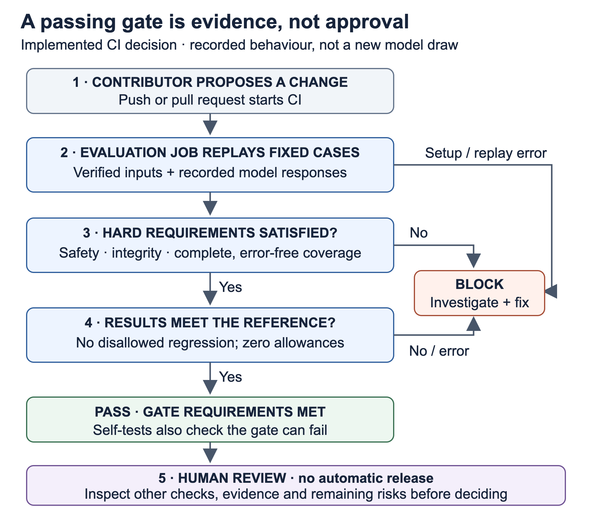

# Release gate: what passes, what blocks, who decides

A change can leave the application running while quietly weakening its answers or access controls. The gate replays fixed synthetic questions through the changed pipeline, checks hard requirements, and compares the measured results with an approved reference. A pass is evidence for a reviewer, not permission to release or proof of production safety.

Caption: **Release gate lifecycle** — a reader's view of the Implemented CI decision, not a separate deployment service.
Legend: solid arrows show Implemented checks and outcomes; the final human decision is a review responsibility, not automated release. [Editable SVG](images/release-gate.svg).

## Read the decision in five steps

| Step and owner | What happens | Evidence |
| --- | --- | --- |
| 1. Contributor proposes a change | CI runs checks on pushes and pull requests. The frozen data, model and replay configuration are not silently replaced. | [Workflow](../.github/workflows/ci.yml), [configuration tests](../tests/test_ci_gate_configuration.py) |
| 2. Evaluation job replays fixed questions | Real local embeddings and the actual adapter process recorded model responses: 130 primary phrasings and 22 probes. CI makes no live generation calls. | [Replay implementation](../src/rag_audit/evaluation/replay.py), [replay tests](../tests/test_replay.py) |
| 3. Gate checks hard requirements | Safety failures, incomplete coverage, operational errors, or mismatched model/configuration/replay integrity block a pass. | [Gate](../src/rag_audit/evaluation/ci_gate.py), [gate self-tests](../tests/integration/test_gate_selftest.py) |
| 4. Gate compares with the reference | Quality counts must meet their stated directions with zero allowances; latency is informational. Hard requirements and comparison checks all contribute to the verdict, rather than cancelling one another out. | [Exact check table](evaluation.md#ci-regression-gate), [gate self-tests](../tests/integration/test_gate_selftest.py) |
| 5. Reviewer decides what to do | Inspect the verdict, remaining risks and other required checks. A failed gate needs investigation; a passed gate does not automatically merge, publish or certify anything. | [Failure protocol](evaluation.md#failure-and-re-baseline-protocol), [audit findings](audit/README.md) |

The diagram groups checks for explanation; it does not promise the program stops reporting at the first failure. The evaluation job also runs `make eval-selftest`: deliberately faulty variants must fail while passing controls succeed. Historical [passing and deliberately failing hosted runs](audit/report.md#10-regression-plan-and-existing-hosted-evidence) are revision-specific observations, not fresh verification of this page's revision.

## If the gate blocks

Preserve the output and resolve integrity, cache or replay-staleness errors before interpreting quality. Do not loosen a threshold, replace a frozen fixture or edit an expected result merely to make CI green. An intentional baseline change follows the [explicit local re-baseline protocol](evaluation.md#failure-and-re-baseline-protocol), with evidence, a reason, a changelog marker and chained history; hard safety failures cannot be accepted that way.

For local reproduction, follow [evaluation setup](evaluation.md#ci-regression-gate), then run `make eval-gate` and `make eval-selftest` against an isolated database and verified model. The normal lint, type and unit/documentation checks are separate and do not require Docker or a model.

## What a pass cannot tell you

Replay tests recorded responses, not a future provider version or a fresh model draw. All domain data is synthetic, all 65 labels remain drafted with zero human review, and the sample audit is a builder self-assessment. A green gate does not establish regulatory compliance, broad attack resistance, production authentication or useful coverage on real data.
